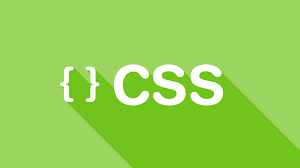

# Everything about CSS

**This Repo will cover all the basic & advanced topics in CSS, we will be covering:**

1. Display
2. breakdown of each of display property (flex - grid - inline - inline-block) with examples
3. Positions
4. Selectors
5. Box model
6. Tables
7. Transitions
8. Animations
9. Media Queries
10. CSS semantics
11. naming conventions (BEM - prefix naming) 

## Display

- There are 23 different display properties in CSS

> not all these props are used, some of them are very old

| Display                | Description   | 
| ---------------------  |:-------------:|
| inline                 | Displays an element as an inline element (like `<span>`). <br> Any height and width properties will have no effect |
| block                  | Displays an element as a block element (like `<p>`).<br> It starts on a new line, and takes up the whole width |
| contents               | Makes the container disappear, making the child elements children <br> of the element the next level up in the DOM|
| flex                   | Displays an element as a block-level flex container|
| grid                   | Displays an element as a block-level grid container	|
| inline-block           | Displays an element as an inline-level block container. The element itself <br> is formatted as an inline element, but you can apply height and width values |
| inline-flex            | Displays an element as an inline-level flex container |
| inline-grid            | Displays an element as an inline-level grid container |
| inline-table           | The element is displayed as an inline-level table |
| list-item              | Let the element behave like a `<li>` element |
| run-in                 | Displays an element as either block or inline, depending on context |
| table                  | Let the element behave like a `<table>` element |
| table-caption          | Let the element behave like a `<caption>` element |
| table-column-group     | Let the element behave like a `<colgroup>` element |
| table-header-group     | Let the element behave like a `<thead>` element |
| table-footer-group     | Let the element behave like a `<tfoot>` element |
| table-row-group        | Let the element behave like a `<tbody>` element |
| table-cell             | Let the element behave like a `<td>` element |
| table-column           | Let the element behave like a `<col>` element |
| table-row              | 	Let the element behave like a `<tr>` element |
| none                   | The element is completely removed |
| initial                | Sets this property to its default value |
| inherit                | Inherits this property from its parent element |

### Flex display property

#### Properties for the Parent

- `Display: flex`, defined a flex container, enabling flex context for all the children
```
.container {
  display: flex;
}
```

- `flex-direction: row | row-reverse | column | column-reverse`, specify the main axis, flex items can be

aligned either in horizontal rows or vertical columns 
``` 
.container {
  flex-direction: row;  //  align items in horzontal row
}
```
- `flex-wrap: wrap | nowrap | wrap-reverse`, flex items will try to fit in one line, `flex-wrap` makes
the element wrap to a new line

- `nowrap`: elements will be on the same line
- `wrap`: elements will be wrap into multiple lines
- `wrap-reverse`: similiar to `wrap` but from bottom to top

```
.container {
  flex-wrap: wrap
}
```


## Position

- There are 5 different position values in CSS
1.  Static
2.  Relative
3.  Fixed
4.  Absolute
5.  Sticky

> The elements are positioned using `top`, `bottom`, `left`, `right` properties, however these properties will not work unless the `position` property is set first.

## Selectors

1. `*` selects all the elements
2. `div` selects all the div tags
3. `div,p` selects all the div's & paragraphs
4. `div p` selects paragraphs inside divs
5. `div > p` selects all paragraphs, one level deep in div
6. `div + p` selects p tags immediately after div's
7. `div ~ p` selects p tags preceded by div 
8. `.classname` select element with Class name
9. `#idname` select element with Id
10. `div.classname` select divs with certain Class name
11. `div#idname` select div with certain Id name
12. `#idname*` select all the elements inside `#idname`

### Pseudo classes selectors

1. `a:link` link in normal state
2. `a:active` link in clicke state
3. `a:hover` link in hover state
4. `a:visited` already clicked link (visited)
5. `p::after{content:"foo"}` add content after `p` element
6. `p::before` add content before `p` element
7. `input:checked` select checked input
8. `input:disabled` select disabled input
9. `input:enabled` select enabled input(s)
10. `input:focus` input is in focus state
11. `input:in-range` input is in range
12. `input:out-of-range` input is out of range
13. `input:valid` input with valid values
14. `input:invalid` input with invalid values
15. `input:optional` input with no required attributes
16. `input:read-only` input with readonly attribute
17. `input:read-only` input with no readonly attribute
18. `div:empty` elements with no children
19. `p::first-letter`first letter in p
20. `p::first-line` first line in p
21. `p:first-of-type` first of some type
22. `p:last-of-type` last of some type
23. `p:lang(en)` p with en language attribute
24. `:not(span)` element that's not a span
25. `p:first-child` first child of its parent
26. `p:last-child` last child of its parent
27. `p:nth-child(2)` second child of its parent
28. `p:nth-child(3n+1)` nth-child (an + b) formula
29. `p:nth-last-child(2)` second child from behind
30. `p:nth-of-type(2)` second p of its parent
31. `p:nth-last-of-type(2)` scond childfrom behind
32. `p:only-of-type` unique of its parent
33. `p:only-child` only child of its parent
34. `:root documents` root element
35. `::selection` portion selected by user
36. `:target` highlight active anchor

### Attribute selectors
1. `a[target]` link with a target attribute
2. `a[target="_blank"` link which opens in new tab
3. `[title="chair]` title elements with a word
4. `[class^="chair]` class name that starts with chair
5. `[class|="chair"]` class start the chair word
6. `[class*="chair"]` class contains chair
7. `[class$="chair"]` class ends with chair
8. `input[type="button"]` select an input with type button


